### `gabriel@github ~ $ ./contributions.sh`

<!-- animated contribution graph: real data, boxes reveal diagonally.
     regenerated daily by .github/workflows/update-profile-art.yml -->

  

 

### `gabriel@github ~ $ whoami`

<!-- neofetch-style info card: rows fade in line by line -->

  

 

  <a href="https://gabrielsales.framer.ai/"><b>Portfolio</b></a> &nbsp;·&nbsp;
  <a href="https://www.linkedin.com/in/gabriel-sales-bezerra/"><b>LinkedIn</b></a> &nbsp;·&nbsp;
  <a href="mailto:gabrielsales081@gmail.com"><b>Email</b></a>

 

### `gabriel@github ~ $ cat about.md`

I build web and mobile interfaces, mostly in **React, Next.js and TypeScript**.

What I actually spend my days on is less glamorous than a stack list: designing component
APIs that survive contact with a real product, tracing UI bugs back to their root cause
instead of patching the symptom, and refactoring code I didn't write so the next person
can read it.

I work across the web/mobile boundary — the same feature in Next.js on the web and in
Flutter or Kotlin in the app — which has made me better at the part most frontend work
actually depends on: agreeing on contracts and keeping two codebases telling the same story.

I use AI heavily in my own workflow (AI-assisted coding, context engineering, system
prompts, MCP integrations), and I'm interested in where models reason well about code
and where they quietly fall apart.

 

### `gabriel@github ~ $ ls selected-work/`

Most of my strongest work lives in private client and company codebases, so here is what
I solved rather than a link I can't share.

**Multi-tenant ERP — permission and tenancy isolation** &nbsp;·&nbsp; `private`

> An ERP where one person can belong to several companies, holding a different role in each.
> I reworked the scoping layer so permissions and data never leak across company/role
> boundaries, and rebuilt the company-switcher flow, which was wiping the user's session
> state on every switch.

**Corporate ERP modernization** &nbsp;·&nbsp; `Next.js` `TypeScript` &nbsp;·&nbsp; `private`

> Led the architectural refactor alongside a Senior Tech Lead — Clean Architecture and DDD
> to decouple business rules from the framework, replacing a legacy system with a testable,
> framework-agnostic codebase. Built the shared component library the platform runs on.

**Logistics app — offline-first delivery flow** &nbsp;·&nbsp; `Flutter` `Dart` &nbsp;·&nbsp; `private`

> Built the Picking, Checking and Shipping modules, including background image upload with
> local persistence — which removed the connectivity bottleneck drivers hit in the field.

 

### `gabriel@github ~ $ ls public/`

| Repo                                                               | What it solves                                                                                                                                                      |
| ------------------------------------------------------------------ | ------------------------------------------------------------------------------------------------------------------------------------------------------------------- |
| [**time_capsule**](https://github.com/sales-gb/time_capsule)       | Career-timeline app built end to end — React Native client, REST API and web frontend. The repo that best shows how I structure things when every decision is mine. |
| [**kenzie-contacts**](https://github.com/sales-gb/kenzie-contacts) | Full stack contact manager with JWT auth, request validation and relational modeling.                                                                               |
| [**Greenly**](https://github.com/Impactify-FIAP/Greenly)           | Native Android app (Kotlin, MVVM) gamifying carbon-emission tracking.                                                                                               |

 

### `gabriel@github ~ $ cat stack.txt`

 

### `gabriel@github ~ $ whoami --status`

Open to remote frontend roles with US and global teams.
Based in São Paulo, Brazil (UTC−3) · Portuguese native, English for technical work.
